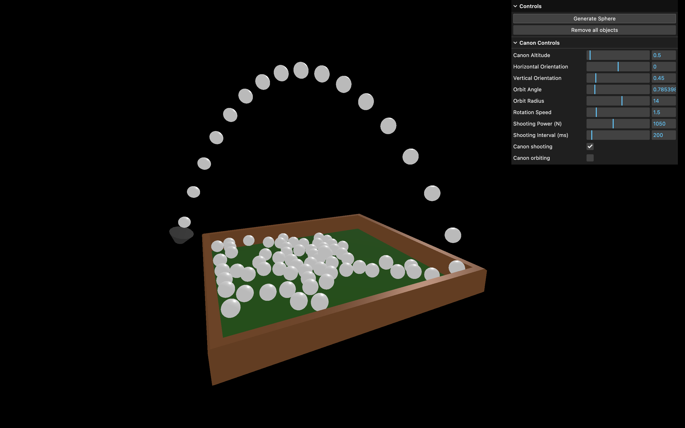

# 🌍 Three.js – Simulateur de Physique avec canon 🏴‍☠️🎱

Une scène 3D interactive de simulation physique créée avec [Three.js](https://threejs.org/) et [Cannon-es](https://pmndrs.github.io/cannon-es/docs/modules.html), inspirée du parcours Three.js Journey par Bruno Simon. Avec un système de canon interactif et des contrôles avancés.



## 🚀 Démo

[Voir la démo](https://rekuiem84.github.io/basic-physics-threejs/)

## ✨ Fonctionnalités

### 🎯 Système de Canon Avancé

- Canon positionnable et orientable avec contrôles précis
- Tir automatique de sphères avec vitesse de tir et puissance réglable
- Rotation en orbite autour de la piscine
- Orientation verticale et horizontale du canon réglable
- Interface GUI complète pour tous les paramètres

### 🌍 Simulation Physique

- Simulation physique réaliste avec gravité et collisions
- Piscine avec fond et murs de collision physiques
- Génération de sphères avec propriétés physiques
- Sons de collision basés sur l'intensité de l'impact
- Système de matériaux physiques (friction, rebond)

### 🎮 Interface & Contrôles

- Contrôles de caméra libre (OrbitControls)
- Interface de debug (lil-gui) étendue avec librairie cannon-es
- Génération manuelle d'objets et réinitialisation de scène

## 🛠️ Installation & Lancement

1. **Cloner le dépôt :**

   ```bash
   git clone https://github.com/Rekuiem84/basic-physics-threejs
   cd basic-physics-threejs
   ```

2. **Installer les dépendances :**

   ```bash
   npm install
   ```

3. **Lancer le serveur de développement :**

   ```bash
   npm run dev
   ```

4. **Build pour la production :**

   ```bash
   npm run build
   ```

   Les fichiers optimisés seront générés dans le dossier `dist/`.

## 📁 Structure du projet

```
├── src/           # Fichiers sources
├── static/
│   └── sounds/    # Fichiers audio pour les collisions
├── dist/          # Fichiers générés pour la production
├── package.json   # Dépendances et scripts
└── vite.config.js # Configuration Vite
```

## ▶️ Contrôles et interactions

### 🎮 Interface Générale

- **Bouton "Generate Sphere"** : Génère une sphère avec taille et position aléatoires
- **Bouton "Shoot Sphere"** : Tire une sphère depuis le canon
- **Bouton "Remove all objects"** : Supprime tous les objets générés
- **Souris** : Contrôles de caméra (rotation, zoom, panoramique)

### 🚀 Contrôles du Canon (Dossier "Canon Controls")

- **Canon Altitude** : Hauteur du canon au-dessus du sol
- **Horizontal Orientation** : Rotation horizontale du canon (-π à π)
- **Vertical Orientation** : Inclinaison verticale du canon (0 à π)
- **Orbit Angle** : Position angulaire du canon autour de la piscine (à l'arret)
- **Orbit Radius** : Distance du canon par rapport au centre de la piscine
- **Rotation Speed** : Vitesse de rotation orbitale
- **Shooting Power (N)** : Force appliquée aux projectiles tirés depuis le canon (0 à 2500N)
- **Shooting Interval (ms)** : Délai entre chaque tir automatique (50 à 2000ms)
- **Canon shooting** : Active/désactive le tir automatique
- **Canon orbiting** : Active/désactive la rotation orbitale

### 🔊 Effets Sonores

- **Collisions** : Sons automatiques basés sur l'intensité de l'impact
- Volume proportionnel à la force de collision

## 🎯 Fonctionnalités techniques avancées

### Système de Canon

- Calcul de trajectoire en temps réel basé sur la rotations 3D du canon
- Application de forces physiques via `applyLocalForce()`
- Système de coordonnées mondiales avec `getWorldPosition()` et `matrixWorld`
- Gestion d'intervalles dynamiques pour le tir automatique

### Physique

- Détection de collision avec callback `addEventListener("collide")`
- Matériaux personnalisés avec friction et restitution
- Corps physiques composites pour la piscine (murs + sol)
- Optimisation des performances avec `allowSleep` et `SAPBroadphase`

## 🔗 Mes autres projets Three.js

- [Repo Three.js Journey principal](https://github.com/Rekuiem84/threejs-journey) — pour retrouver tous mes projets suivant ce parcours
